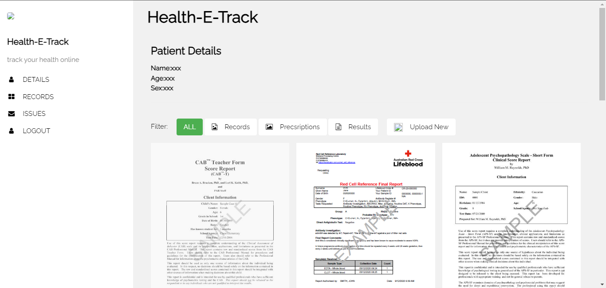

# Health-E-Track

Welcome to Health-E-Track, an online platform for tracking health reports.

 <!-- Include a screenshot of your project if possible -->

## Table of Contents

- [Introduction](#introduction)
- [Features](#features)
- [Getting Started](#getting-started)
  - [Installation](#installation)
- [Usage](#usage)
- [Contributing](#contributing)
- [Contact](#contact)

## Introduction

Health-E-Track is a web application designed to help users track their health reports and related information. It provides an intuitive interface for managing patient details, records, and more.

## Features

- **Patient Details:** Display and manage patient information including name, age, and sex.
- **Record Filtering:** Filter and view different types of health records including images, prescriptions, and results.
- **Pagination:** Navigate through multiple pages of records.
- **Contact:** Report issues or get in touch using provided contact information.

## Getting Started


### Installation

1. Clone the repository:

   ```sh
   git clone https://github.com/your-username/health-e-track.git
   ```

2. Open the project in a web browser or host it on a web server.

## Usage

1. Open the application in your web browser.
2. Use the navigation links to explore different sections: patient details, records, and contact.
3. Filter records by category using the provided buttons.
4. Report any issues using the contact information provided.

## Contributing

Contributions are welcome! If you find any bugs or have suggestions for improvements, please open an issue or create a pull request.


## Contact

If you have any questions or want to get in touch, feel free to reach out:

- Email: vallalarishwanth@email.com
- GitHub: [@rishwanthvallala](https://github.com/rishwanthvallala)
